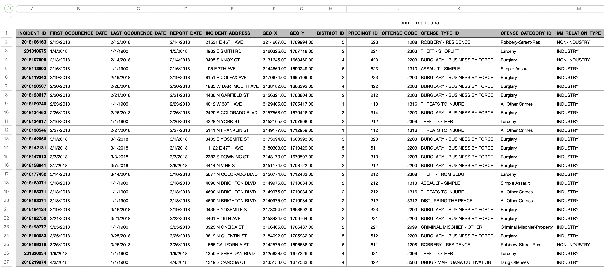

# MachineLearningAlgorithms

## SVM
SVMs, support vector machines are a set of **supervised** learning methods used for classification, regression and outlier detection. 

### Linear Kernel
Before:

After:

### RBF (Gaussian Radial Basis Function) kernel 
Before:

After:

### RBF kernel 3D Version
The previous two examples are quite simple and straightforward. It's either linear data (numpy arrays), or sklearn datasets.
I read somewhere that rbf kernel can be quite powerful. Not only I can use it for more complicated dataset, like plotting 3D scatter fig instead of 2D.
For dataset, I download the chess games csv from Kaggle.

I implemented fitting function, started by splitting "turns" and "white_win" dataframes into training and testing data. 
I use sklearn svm SVC rbf (radial basis function) kernel to train and fit the model. Using this model, I can predict the training and testing X. 
Then I generate the ratio of the number of correctly classified samples to the total number of samples, and the classification reports of test and training data.

