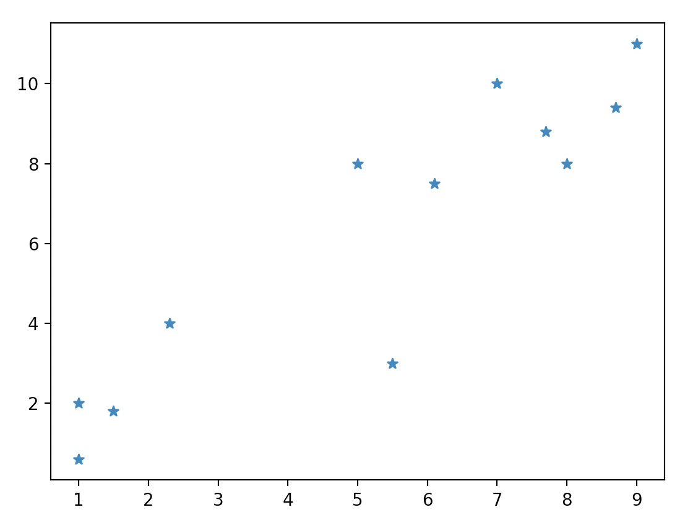
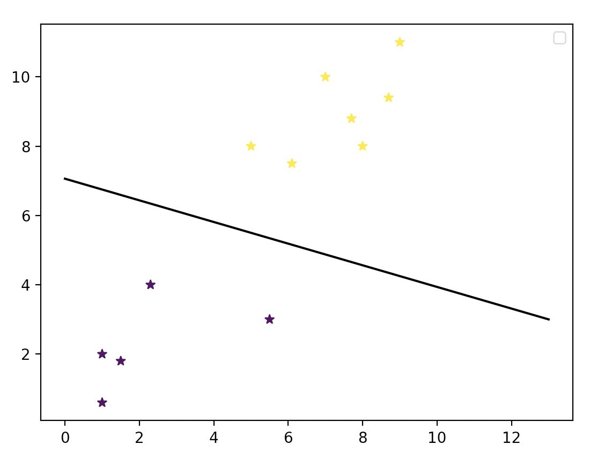
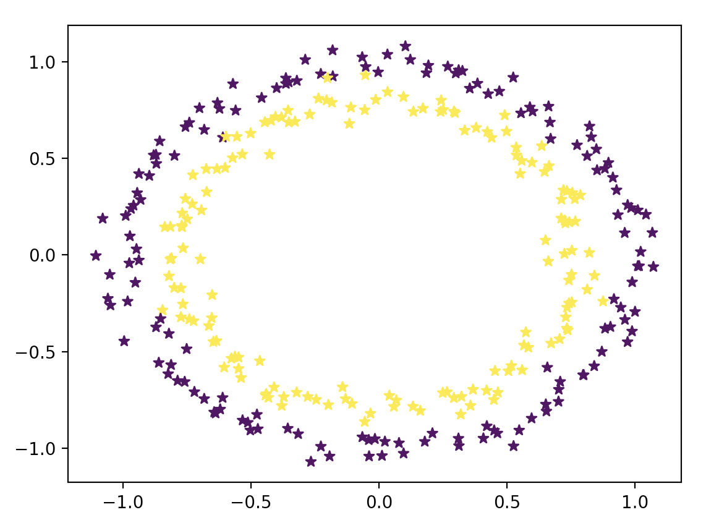
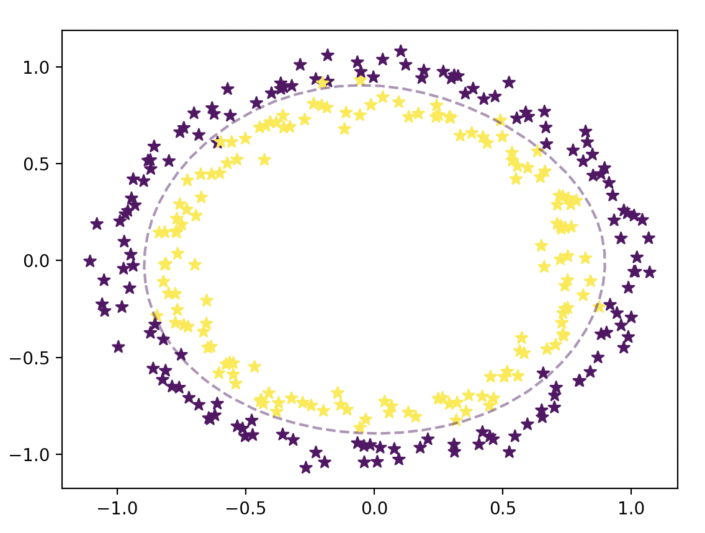
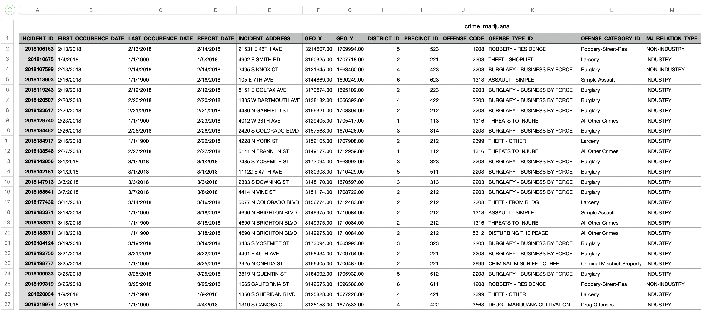
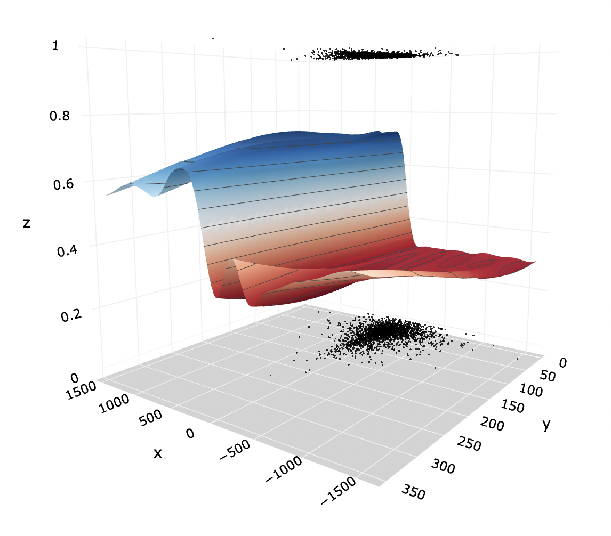
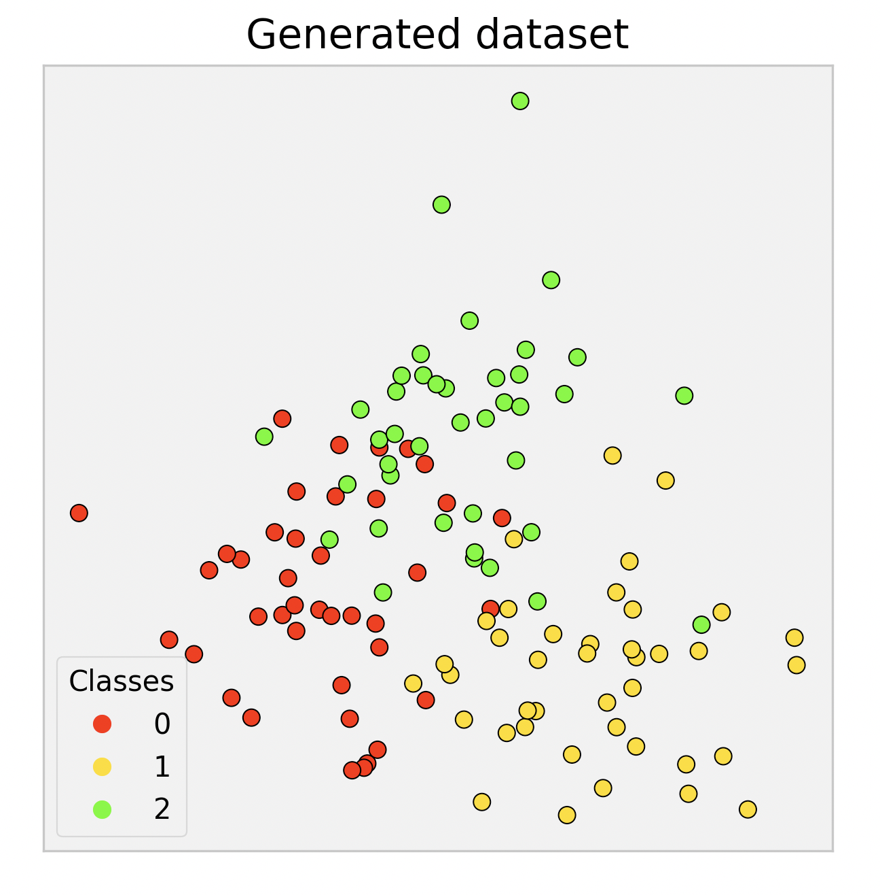
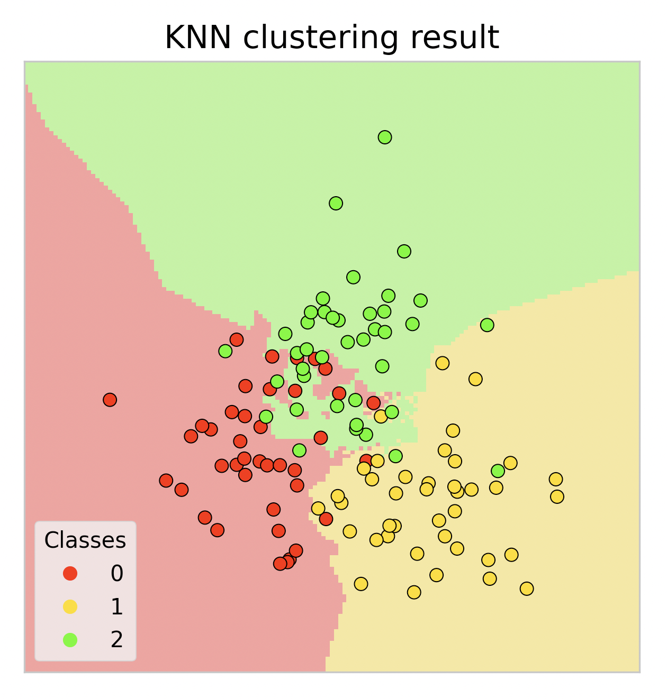
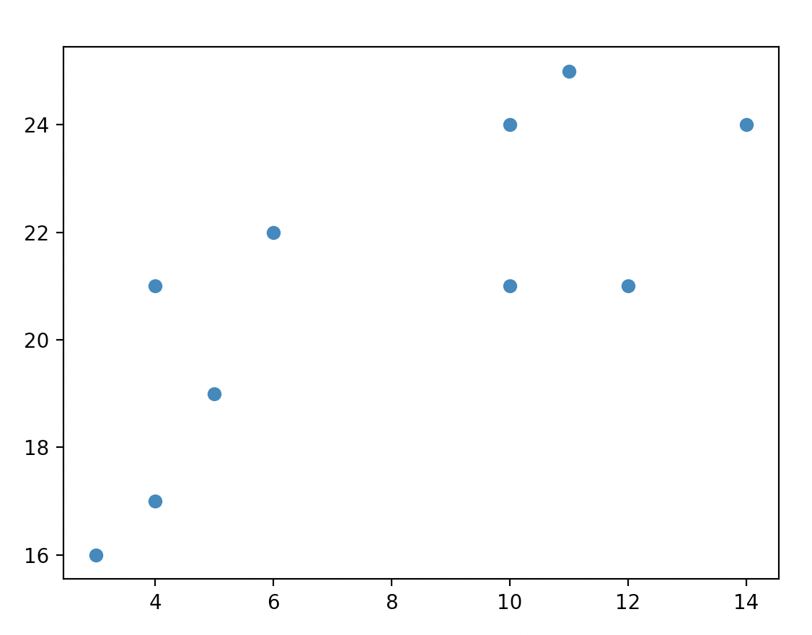
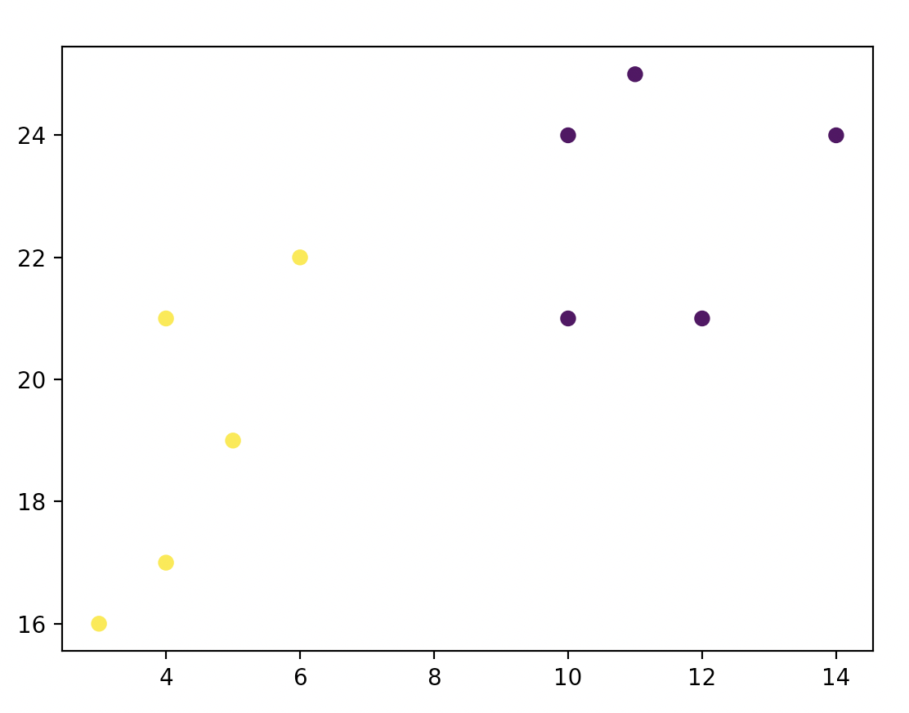

# MachineLearningAlgorithms

## SVM
SVMs, support vector machines are a set of **supervised** learning methods used for classification, regression and outlier detection. 

### Linear Kernel
Before:
 

  
After:
 

### RBF (Gaussian Radial Basis Function) kernel 
Before:
 

  
After:
 

 
Reference:  
[Linear and RBF Kernel SVM Tutorial](https://www.freecodecamp.org/news/svm-machine-learning-tutorial-what-is-the-support-vector-machine-algorithm-explained-with-code-examples)
 

### RBF kernel 3D Version
The previous two examples are quite simple and straightforward. It's either linear data (numpy arrays), or sklearn datasets.  
I read somewhere that rbf kernel can be quite powerful. Not only I can use it for more complicated dataset, like plotting 3D scatter fig instead of 2D.
For dataset, I download the chess games csv from Kaggle.  

I implemented fitting() function, started by splitting "rating_difference" and "turns" fields (X), and "white_win" (y) dataframes into training and test data.  
I use sklearn svm SVC rbf (radial basis function) kernel to train and fit the model. Using this model, I can predict the training and testing X.  
Then I generate the ratio of the number of correctly classified samples to the total number of samples, and the classification reports of test and training data.  
After fitting() function, I implemented Plot_3D() by visualizing the test data and the svm rbf model's predictions using plotly 3d scatter.  
From the screnshot, we can see that the black dots on top are the cases when white wins. The surface in the middle is the dicision boundary set by the rbf kernel model. The black dots at the botton are the cases when white doesn't win.  

 
Reference:  
[3D RBF Kernel SVM](https://towardsdatascience.com/svm-classifier-and-rbf-kernel-how-to-make-better-models-in-python-73bb4914af5b)
 

#### Related Topic: Parametic and non-parametic models
Why is an RBF kernel SVM non-parametric whereas a linear SVM is parametric?  
In the RBF kernel SVM, we construct the kernel matrix by computing the pair-wise distances between the training points, which makes it non-parametric compared to linear SVM.  
 
What's the difference between parametic and non-parametic models?  
In a parametric model, we have a finite number of parameters, and in non-parametric models, the number of parameters is (potentially) infinite.  
 
Parametic ML algo examples:  
Linear models such as linear regression, logistic regression, Perceptron, Naive Bayes, Simple Neural Network and linear SVM.  
Non-parametic ML algo examples:  
K-nearest neighbour, decision trees, or RBF kernel SVMs are all considered as non-parametric learning algorithms since the number of parameters grows with the size of the training set.  
 
Reference:  
[LinkedIn Parametic and non-parametic models differences](https://www.linkedin.com/pulse/what-exactly-difference-between-parametric-model-bhattacharjee/)
 

## KNN
KNN, K-Nearest Neighbors, is a non-parametric algorithm used for classification and regression tasks.
  
Generate and plot data, 3 clusters of points (40 points each):
 

 
The KNN prediction result:
 

 
Reference:  
[K-Nearest Neighbors Algorithm for ML](https://serokell.io/blog/knn-algorithm-in-ml)
 

## KMeans Clustering
Simple version:  
Before:  

 
After:  

  
PyTorch version:  
